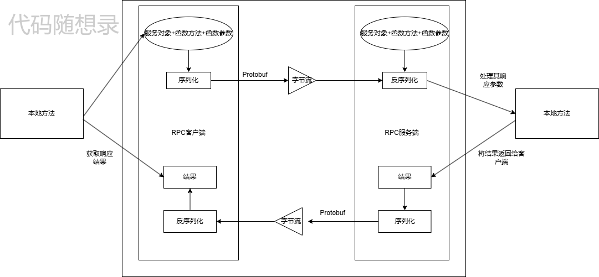
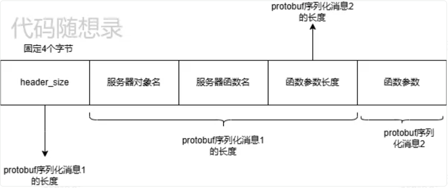
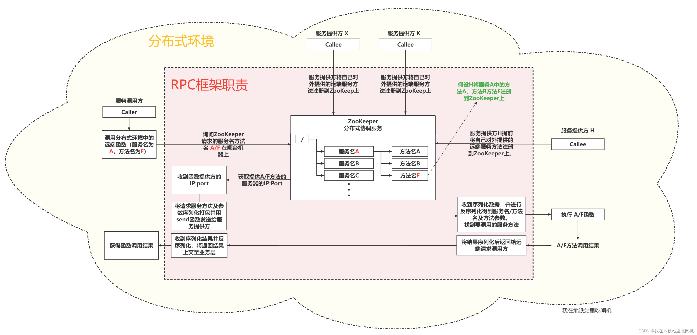
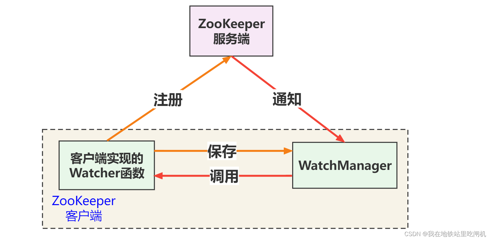

# RPC理论
## 什么是 RPC？
RPC（Remote Procedure Call）是一种使程序能够像调用本地函数一样调用远程服务的方法。它屏蔽了底层的通信细节，使得开发人员无需关注远程调用的复杂性，只需像操作本地方法一样调用远程方法。
## 为什么要用 RPC?
### 1.简化远程调用的复杂性
在分布式系统中，服务往往部署在不同的机器或网络中。如果没有RPC，开发人员需要手动编写复
杂的网络通信代码，比如：
- 创建和管理连接。
- 数据的序列化和反序列化。
- 请求和响应的发送与接收。
- 错误处理（如超时、断线重连等）。
RPC对这些底层逻辑进行了封装，开发人员只需专注于业务逻辑，无需关心底层的通信细节。
### 2.支持微服务架构
随着系统复杂度的增加，微服务架构成为主流。微服务架构的目标是：
- 高内聚、低耦合：通过将功能拆分成多个独立服务，降低模块之间的依赖。
- 灵活扩展：各个服务可以独立扩展、部署和更新。
然而，在微服务架构中，不同服务可能部署在不同的机器或网络环境中，需要高效的通信手段。而
RPC提供了以下支持：
- 跨机器调用：使服务间的通信像本地调用一样简单。
- 高效传输：通过高性能序列化协议（如Protobuf、Thrift）优化**数据传输**。
- 可靠性保障：内置的**重试机制、超时机制**等，确保服务通信的可靠性。
## 通用的应用场景
RPC不仅用于微服务，还在以下场景中广泛应用：
1. 分布式系统：
- 解决跨网络的通信问题。
- 提供一致性调用体验。
2. 跨语言服务调用：
通过支持多语言（如gRPC支持C++、Java、Python等），RPC可以实现跨语言的服务
通信。
3. 性能优化：
利用RPC的高性能序列化协议和连接复用能力，减少网络通信开销。
4. 服务间依赖：
如电商系统中，订单服务调用库存服务，库存服务调用支付服务，RPC能实现服务间的高效
通信。
## RPC远程调用全局概览

- 本地发起远端调用
> 本端发起远端调用需要像RPC框架传入请求发服务对象名（可以理解为类对象）、函数方法名（可以理解为类中的成员函数）、函数参数这三样东西。因为我们网络传输使用是TCP协议，而TCP是没
有消息边界的字节流，所以我们需要自己处理粘包的问题，即给数据消息自定义数据格式。
- 对应的就说图片中（protobuf）
> 序列化技术这里使用的是protobuf，能把一个**类似于结构体的消息序列化为二进制数据**。
```protobuf
syntax="proto3";
package Krpc;
messageRpcHeader{
   bytes service_name=1;
   bytesmethod_name=2;
   uint32args_size=3;
}
```
> 就比如本项目使用的`Rpcheader message`，这个message就当成一个结构体消息(把bytes当成一个string)。这里可以利用protobuf提供的一个`SerializeToString`能把这个`RpcHeader`序列化为二进制数据(字符串形式存储)。当我们对这一段二进制数据调用`ParseFromString`，又能完整取出这个结构体消息的每一个字段。（不需要担心三个字段序列化成二进制数据后，每个字段分界的问题，protobuf给你安排的明明白白。）
- 本项目是是怎么定义数据消息的传输格式：

> 首先我们有一个protobuf类型的结构体消息RpcHeader，这个RpcHeader有三个字段，分别是服务对象名，服务函数名和函数参数长度。同时我们的函数参数(args)是可变的，长度不确定的，所以不能和Rpcheader一起封装，否则有多个函数就会有多个Rpcheader，所以我们一般是专门在对所需要进行远端调用的函数进行protobuf的封装(比如请求参数和响应参数)，在RpcHeader只封装服务名、函数名、以及参数的大小，具体对来说是进行远端调用函数的request参数的大小。
## protobuf
https://protobuf.com.cn/programming-guides/proto3/
### 定义一个消息类型
先来看一个非常简单的例子，假设你想要定义一个“搜索请求的消息格式”，每个请求含有一个查询字符串、你感兴趣的查询结果所在的页数，，以及每一页多少条查询结果。可以采用如下的方式来定义消息类型的`.proto`文件了：
```protobuf
syntax="proto3";
packageKrpc;
messageSearchRequest{
   stringquery=1;
   int32page_number=2;
   int32result_per_page=3;
}
```
> 其中，`syntax = "proto3"`指定了使用proto3的语法，如果你没有指定这个，编译器会使用proto2。这个指定语法行必须是文件的非空非注释的第一个行,`package Krpc`定义了包名，`message SearchRequest`定义了消息类型的名称。在花括号内，我们定义了消息的字段：
- `string query = 1`：定义了一个字符串字段`query`，字段号为1。
- `int32 page_number = 2`：定义了一个32位整数字段`page_number`，字段号为2。
- `int32 result_per_page = 3`：定义了一个32位整数字段`result_per_page`，字段号为3。
字段号是每个字段的唯一标识符，用于在序列化和反序列化数据时定位字段。字段号的范围是1到2^29-1（约21亿），不能重复。
## ZooKeeper


- ZooKeeper在这里作为服务方法的管理配置中心，负责**管理服务方法提供者对外提供的服务方法**。服务方法提供者提前将本端对外提供的服务方法名及自己的通信地址信息（IP:Port）注册到ZooKeeper。当Caller发起远端调用时，会先拿着自己想要调用的服务方法名询问ZooKeeper，ZooKeeper告知Caller想要调用的服务方法在哪台服务器上（ZooKeeper返回目标服务器的IP:Port给Caller），Caller便向目标服务器Callee请求服务方法调用。服务方在本地执行相应服务方法后将结果返回给Caller。
- ZooKeeper提供了两个库，分别是`zookeeper_st`（单线程库）和`zookeeper_mt`（多线程库），一般使用`zookeeper_mt`库提供的API。采用`zookeeper_mt`库的zookeeper客户端使用了三个线程：
   + 主线程：用户调用API的线程。
   + IO线程：负责网络通信的线程。
   + completion线程：对于异步请求（Zookeeper中提供的**异步API**，一般都是以`zoo_a`开头的api）以及watcher的响应回调，io线程会发送给completion线程完成处理。
- ZooKeeper是怎么存储数据（服务对象和方法）
> ZooKeeper相当于是一个特殊的文件系统，不过和普通文件系统不同的是，这些节点都可以设置关联的数据，而文件系统中只有文件节点可以存放数据，目录节点不行。ZooKeeper内部为了保持高吞吐和低延迟，再内存中维护了一个**树状的目录结构**，这种特性使ZooKeeper不能存放大量数据，每个节点存放数据的上限为1M。服务对象名在ZooKeeper中以永久性节点的形式存在，当RpcServer与ZooKeeper断开连接后，整个节点还是会存在。方法对象名则以临时性节点存在，RpcServer与ZooKeeper断开后临时节点被删除。临时节点上带着节点数据，在本项目中，节点数据就是提供该服务方法的RpcServer的通信地址（IP+Port)。
- ZooKeeper的watcher机制
> watcher机制就是ZooKeeper客户端对某个znode建立一个watcher事件，当该znode发生变化时，这些ZK客户端会收到ZK服务端的通知，然后ZK客户端根据znode的变化来做出业务上的改变。ZooKeeper服务端收到来自客户端callee的连接请求后，服务端为节点创建会话（此时这个节点状态发生改变），服务端会返回给客户端callee一个事件通知，然后触发watcher回调（执行global_watcher函数）Watcher实现由三个部分组成 1. ZooKeeper服务端 2. ZooKeeper客户端（callee）3. 客户端的ZkWatchManager对象
> Watcher机制类似于设计模式中的观察者模式，也可以看作是观察者模式在分布式场景下的实现方式。
- 针对每一个znode的操作，都会有一个watcher。
- 当监控的某个对象（znode）发生了变化，则触发watcher事件。父节点、子节点增删改都能触发其watcher。具体有哪些watcher事件，后面会贴一张表，自己去看看！
- ZooKeeper中的watcher是一次性的，触发后立即销毁。
ZooKeeper客户端（Callee）首先将Watcher注册到服务端，同时把Watcher对象保存到客户端的Watcher管理器中。当ZooKeeper服务端监听到ZooKeeper中的数据状态发生变化时，服务端主动通知客户端（告知客户端事件类型和状态类型），接着客户端的Watch管理器会触发相关Watcher来回调相应处理逻辑（GlobalWatcher），从而完成整体的数据发布/订阅流程。
## log
glog与log4cplus简洁与应用场景：
- glog:
首先glog是Google开发的一个高性能、轻量级的C++日志库。它具有如下的特点:
1. 高性能：glog采用了高效的缓冲机制，减小了日志记录对程序允许性能的影响。
2. 简单易用：glog接口简洁，易于集成和使用。
3. 可定制性：glog支持多种日志级别，可以根据需求灵活选择的记录的日志内容。
- log4cplus:
1. 强大的日志输出控制：log4cplus支持多种日志输出目标，如控制台、文件、网络等，方
便日志的收集和分析。
2. 可配置性：log4cplus可以通过配置文件灵活地调整日志格式、级别和输出目标，便于在
不改动代码的情况下调整日志记录策略。
- 那我们c++日志系统库的选择依据是？
1. 性能：根据项目的性能要求，选择性能表现更优秀的日志库。
2. 可配置性与扩展性：如果项目需要灵活的调整日志策略或者自定义日志的打印，就需要
考虑配置项多的如log4cpp、log4cplus。
3. 项目规模与复杂度：对于小型或者简单的项目，glog可能更合适，因为它更加轻量级、
易于集成。而对于复杂的大型项目，log4cplus可能更能满足需求，因为它提供了更丰富
的日志功能。
4. 与现有技术栈的兼容性：在选择日志库时，需要考虑它是否与项目的其他技术相兼容，
降低集成成本，比如项目中使用了Google相关的技术，可以考虑使用glog。当然还需要
考虑社群以及更新的情况也是一个很重要的标准。
